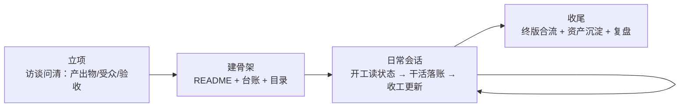

# zmq-project-management

一套 AI 协作场景下的项目管理规范 skill：让 AI 按统一机制管理项目全生命周期——立项访谈、精简目录、版本与产出物线、台账留痕、口径唯一性、会话开工/收工例程、交接与收尾复盘。

采用 [Agent Skills](https://agentskills.io) 开放标准，**不绑定任何特定 AI 工具**：支持该标准的工具可直接安装；不支持的工具可当纯规则文档使用（见安装方式二）。规则提炼自多个真实项目的复盘，只包含项目管理机制，不含个人偏好与环境专属配置；可按团队习惯裁剪。

## 运行逻辑

**核心思路：把项目记忆从"AI 的会话"搬到"项目的文件"里。** AI 负责当记录员和检查员，所有状态落盘在项目目录中——会话断了、换个 AI，项目记忆都还在。



skill 在三个时刻介入：

1. **立项**：AI 逐轮追问三要素（做出什么、给谁用、如何验收），收敛后生成一页启动卡和目录骨架，之后不再反复问。
2. **每次会话**：开工先读 README、台账和最近的迭代记录，快速重建上下文再干活；过程中版本升级、决策、推翻都落账；收工更新待办与当前版指针。
3. **收尾**：标记唯一终版、沉淀可复用资产、生成项目复盘。

## 优势

- **跨会话、跨 AI 不失忆**——项目状态全在文件里；多个 AI 协作时共用一套台账，互相知道对方做了什么。
- **版本永不丢**——产出只增不覆盖，当前版有唯一指针表，支持"回到 v5"式指名回滚。
- **口径不漂移**——指标、术语、契约只在权威源定义一次，产出只引用；变更触发全链路同步和一致性扫描。
- **人不填表**——使用者只做三件事：给原料、提意见、做决策；结构化、记录、检查全部是 AI 的工作。
- **状态不含糊**——交付进度只用状态阶梯表述（探索→候选→已定稿→已交付），没有"差不多好了"。

规则不是设计出来的流程，是从多个真实项目的复盘中提炼的做法；且刻意轻量——目录用到才建，台账不记闲聊。

## 安装

### 方式一：支持 Agent Skills 标准的 AI 工具

把 `zmq-project-management/` 文件夹复制到你所用工具的 skills 目录，新会话即生效：

| 工具 | 个人级（所有项目生效） | 项目级（仅该项目生效） |
| -- | -- | -- |
| Claude Code | `~/.claude/skills/`（Windows：`%USERPROFILE%\.claude\skills\`） | 项目根 `.claude/skills/` |
| 其他支持 Agent Skills 的工具 | 见该工具文档约定的 skills 目录 | 同左 |

验证：对 AI 说"启动一个新项目"，或按你所用工具的 skill 调用方式（如 `/zmq-project-management`）。

### 方式二：任何 AI 工具（通用，无需 skills 机制）

- 把 `SKILL.md` 正文（frontmatter 以下部分）贴入你所用工具的规则文件——如 Codex 的 `AGENTS.md`、Cursor 的 rules 文件——或在会话开头把整个文件投喂给 AI。
- 把 `references/复盘模板.md` 放在项目内 AI 可读取的位置（项目收尾时会用到）。

## 用法

装好后不需要记任何命令，对 AI 说人话：

| 场景 | 你说 | AI 做 |
| -- | -- | -- |
| 开新项目 | "启动一个新项目，做××" | 发起立项访谈 → 建骨架 → 进入执行 |
| 日常推进 | "继续××项目" | 读 README+台账重建上下文，接着上次干 |
| 随时留痕 | "记账" | 立即把当前进展/决策写入台账 |
| 接管旧项目 | "按规范接管这个项目" | 只读盘点 → 出现状清单 → 经你确认后重组 |
| 项目收尾 | "项目收尾" | 终版合流 → 资产沉淀 → 生成复盘 |

所有记录都是项目目录里的普通 Markdown 文件，随时可人工翻看和修改。

## 目录结构

```
zmq-project-management/
  SKILL.md              规范正文（12 节）
  references/
    复盘模板.md          项目收尾时按需加载的复盘模板
  CHANGELOG.md          版本记录
```

## 建议自定义的点

- 跨项目资产库位置（首次项目收尾时 AI 会询问一次并记录）。
- 阶段闸门粒度、台账拆分阈值（默认 50 条/300 行）、开工读取条数（默认 20）。
- 版本文件命名风格（默认 `名称-vN.扩展名`）。
- 与飞书相关的条件规则（不用飞书可删）。

## 版本

当前 v1.0（2026-07-17），修订历史见 `zmq-project-management/CHANGELOG.md`。修改建议走仓库 Issue/PR；本地定制建议 fork 后自立版本线，升级时对照 CHANGELOG 合并。
