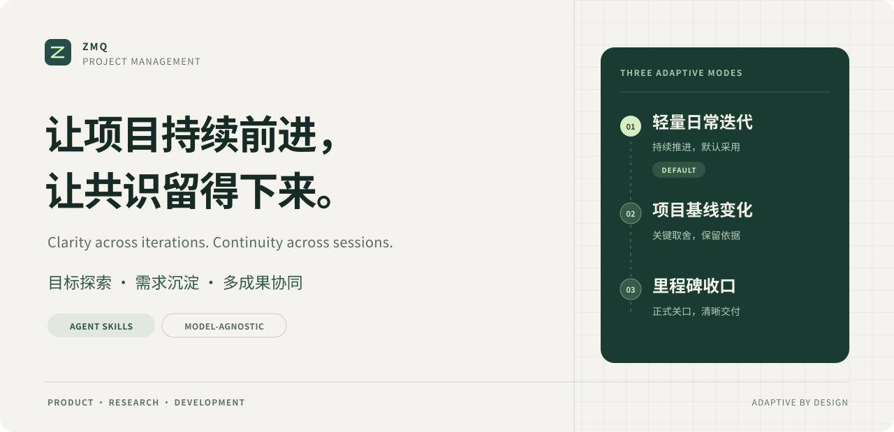

<p align="center">
  
</p>

<h1 align="center">ZMQ Project Management</h1>

<p align="center">
  面向 AI 协作的自适应项目管理 Skill<br>
  <sub>Clarity across iterations. Continuity across sessions.</sub>
</p>

<p align="center">
  <a href="https://github.com/night-silence-z/zmq-project-management/releases/tag/v2.1.0-rc.1"></a>
  <a href="https://github.com/night-silence-z/zmq-project-management/actions/workflows/validate.yml"></a>
  <a href="LICENSE"></a>
  <a href="https://agentskills.io"></a>
</p>

<p align="center">
  <a href="#quick-start">快速开始</a> ·
  <a href="#capabilities">能力地图</a> ·
  <a href="#workflows">适用场景</a> ·
  <a href="#operating-modes">三级模式</a> ·
  <a href="#validation">验证与边界</a>
</p>

---

## 为持续推进的项目，保留一条清晰的主线

从一个模糊想法，到反复调整的 Demo，再到需求文档或多份分析报告，项目最需要被记住的往往是：

**为什么做、现在按什么逻辑做、哪些已经确认，以及下一步该验证什么。**

这个 Skill 为这些信息提供轻量、可接续的管理方式。它引导 AI 在方向不清时追问，在日常迭代中维护有效需求，在关键变化时保留决策，并在真正交付时整理证据与交接。

它不是新的任务管理平台，也不要求迁移现有项目。你可以继续使用已有文档、Issue、目录和版本控制。

<a id="capabilities"></a>

## 能力地图

| 能力 | 如何参与工作 | 留下什么 |
| :-- | :-- | :-- |
| **目标探索** | 围绕真实使用者、业务场景和第一版用途分轮澄清 | 当前理解、范围与可逆假设 |
| **持续需求** | 随实质迭代原位更新，替换失效逻辑 | 当前有效规则、来源与待确认点 |
| **多成果协同** | 区分共享输入、共用约定和各成果独立方法 | 可追溯的依赖与影响范围 |
| **决策与风险** | 在关键取舍、推翻、阻塞发生时保留依据 | 选择、理由、风险及恢复条件 |
| **适量验证** | 按用途和变更依赖检查，复用仍有效的证据 | 已检查的范围、结果与边界 |
| **授权连续性** | 沿用同一目标、对象和范围内的明确授权 | 在关键变化处确认，而非重复问同一件事 |
| **可接续交付** | 说明结果、逻辑和用户下一步需要验证什么 | 可用的成果入口与具体接续动作 |

> **已实现 ≠ AI 已检查 ≠ 用户已验收。**<br>
> 三者分别记录，让“完成了”有清楚、可观察的含义。

<a id="workflows"></a>

## 三类典型工作流

### 01 / 产品探索 · 从想法到 Demo，再到 PRD

**大致描述 → 场景澄清 → 初版 Demo ⇄ 试用与迭代 → 需求整理**

连续迭代时，维护的是“当前有效逻辑”，而不是堆积每一版的全部要求。用户指示、AI 暂定实现和实际验证结果会被区分；到需要输出 PRD 时，再将确认过的逻辑交给适用的文档工作流。

- 页面、字段和交互细节的变化通常保持轻量模式。
- 本地模拟、占位数据与未实现能力明确标注。
- 需求文档以已有有效需求为依据，不从代码中自行补出产品意图。
- 初版、可运行或初步评审，不自动等于正式冻结。

### 02 / 分析研究 · 一套输入，多条分析方向

**共享数据与材料 → 识别实际共用约定 → 独立报告 → 按依赖更新**

多份报告可以共用原始数据、清洗结果或基础事实，同时使用不同的方法回答不同的问题。某个输入变化后，沿实际依赖判断影响，而不是因为“属于同一项目”就全部重做。

- 共享约定从实际材料中识别，不要求先设计完整口径体系。
- 同一报告的修订是版本，不同方向的报告是不同成果。
- 活文档持续更新；冻结成果保留对应的输入状态和引用关系。

### 03 / 研发与长期协作 · 每次接上上一次

**接续当前状态 → 推进明确任务 → 检查受影响行为 → 交还可验证结果**

跨会话优先读取已有入口和当前任务相关记录，出现缺口、冲突或依赖变化再扩读。关键决定与风险留下来，普通进展无需反复同步整套管理文档。

- 已有项目结构和必需检查继续适用。
- 技术风险决定检查深度，不直接触发里程碑。
- “今天先到这里”“下次继续”通常只需要一个清楚的恢复点。

<a id="operating-modes"></a>

## 三级模式，一套判断逻辑

**看任务改变了什么，而不是看任务做了多久。**

| 模式 | 何时使用 | 管理动作 |
| :-- | :-- | :-- |
| **01 · 轻量日常迭代**<br>默认 | 同一方向内探索、实现、纠错、整理和试用 | 完成任务；有实质变化才更新对应需求或状态 |
| **02 · 项目基线变化** | 改变已确认目标、边界、关键定义、承诺或验收依据 | 更新相关权威源，记录理由及受影响范围 |
| **03 · 里程碑收口** | 明确要求正式定稿、发布、冻结、阶段验收或正式移交 | 核对本次交付条件、有效证据、版本指针和未决事项 |

目标探索不是第四套管理流程；它可以发生在建档之前。任务复杂、风险较高、迭代多轮，也不自动要求全套收口。

<a id="quick-start"></a>

## 快速开始

### 安装

[下载 v2.1.0-rc.1 试用包](https://github.com/night-silence-z/zmq-project-management/releases/download/v2.1.0-rc.1/zmq-project-management-v2.1.0-rc.1.zip) · [查看预发布说明](https://github.com/night-silence-z/zmq-project-management/releases/tag/v2.1.0-rc.1) · [稳定版 v2.0.0](https://github.com/night-silence-z/zmq-project-management/releases/tag/v2.0.0)

解压后，将 **`zmq-project-management/` 整个目录**放入所用 AI Agent 支持的技能目录，保留目录名。若已有旧版，先备份再替换；无需移动业务项目或删除历史资料。

也可以克隆仓库，再取出同名技能目录：

```bash
git clone https://github.com/night-silence-z/zmq-project-management.git
```

安装包只需要技能目录；仓库的介绍页、`evals/`、`tests/` 和 CI 配置均属于维护材料。格式不绑定特定模型或工具，实际调用方式及权限仍取决于你的 Agent 环境。

### 开始对话

```text
使用 $zmq-project-management。这个项目需要持续迭代，
先帮我把实际场景和第一版要解决的问题问清楚。
```

也可以直接交代当前任务：

| 你可以这样说 | Skill 应如何参与 |
| :-- | :-- |
| “先做一版看看，细节我来试。” | 说明暂定假设，在可逆范围内开始 |
| “继续改这个 Demo，同时记住新的需求逻辑。” | 更新实现及对应的当前需求 |
| “这几份报告共用数据，先处理这次数据修正的影响。” | 找到实际依赖，只更新受影响成果 |
| “现在可以整理需求文档了。” | 汇集有效逻辑，区分已确认与未决部分 |
| “今天先到这，告诉我下次接着做什么。” | 留下必要结果、边界和恢复点 |

## 2.1 这次升级了什么

- **更主动地问目标**：从建档流程中独立出来；多轮问题承接用户回答。
- **更完整地记住迭代**：需求持续沉淀，但普通细节调整不自动升级基线。
- **更适配非研发项目**：覆盖 Demo / PRD 与共享输入下的多成果关系。
- **更明确地控制检查范围**：复用有效证据，取消健康检查的隐式全项目 Markdown 扫描。
- **更清楚地交还用户**：完成项、关键逻辑、AI 检查边界、具体用户验证场景。
- **更少默认结构**：脚手架默认不写 AGENTS / CLAUDE，健康检查支持自定义入口。

当前为 **2.1.0-rc.1 预发布**，仍需真实项目试用反馈。已有 v2 项目可以直接替换技能；v1 项目可保留目录与历史，停止普通修改时复制活文档新版本，并按需要调整旧的项目自举规则。

<a id="validation"></a>

## 验证与边界

| 已有证据 | 说明 |
| :-- | :-- |
| **23 项自动化检查** | 覆盖辅助脚本、技能结构与评估工具；具体执行记录见下方链接 |
| **4 个独立模拟场景** | 目标多轮澄清、Demo 需求更新、多报告局部传播、已有验证证据复用 |
| **11 个评估场景** | 是可继续运行的评估资产，不代表全部完成了独立代理试跑 |

[阅读实际试跑记录](evals/trial-2.1.0-rc.1.md) · [评估方法](evals/README.md) · [CI 运行记录](https://github.com/night-silence-z/zmq-project-management/actions) · [完整变更记录](CHANGELOG.md)

这个 Skill 管理项目连续性，不替代专业设计、分析或开发能力，也不代替用户的业务验收。它不会授予额外工具权限、自动增加通知对象，或将文档排版扩展为产品逻辑补全。

模拟测试不构成提效比例的证明；真实长周期迭代、完整 PRD 生成与外部消息授权体验仍需实测。

<details>
<summary><strong>给维护者：目录与验证方式</strong></summary>

```text
zmq-project-management/      # 可独立安装的技能包
  SKILL.md                  # 核心判断与按需路由
  agents/openai.yaml        # UI 元数据
  references/               # 目标、需求、多成果、基线、版本与交接
  assets/templates/         # 可选项目模板
  scripts/                  # 初始化、定向健康检查、术语检查
docs/assets/                # 仅用于仓库介绍页
evals/                      # 行为场景与评分工具
tests/                      # 标准库自动化测试
```

```bash
python -m unittest discover -s tests -v
python evals/build_fixtures.py
python evals/score_run.py --help
```

辅助脚本依赖 Python 标准库，CI 配置覆盖 Python 3.9 / 3.12。评估夹具默认写入隔离临时目录，不覆盖已有结果。机器约束通过后，仍需审阅代理的实际行为与产物。

</details>

---

<p align="center">
  <strong>项目可以持续演进，共识不必每次重来。</strong><br>
  <sub>Built for thoughtful AI collaboration · <a href="LICENSE">Apache License 2.0</a></sub>
</p>
